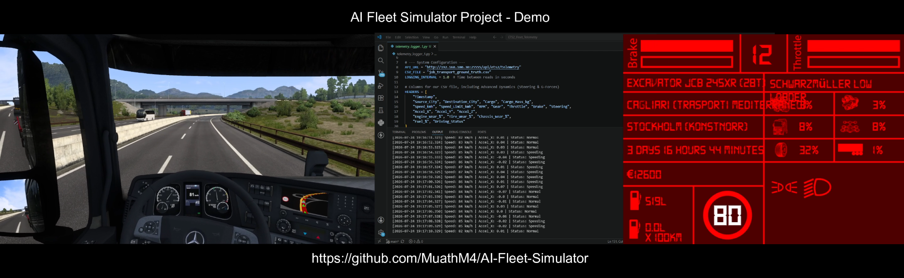

# AI Fleet Simulator: IoT Telematics & Driver Behavior Analytics

## What This Does
- Extracts real vehicle telemetry from ETS2
- Trains ML model to detect driving behavior
- Achieves 99.22% accuracy on unseen data
- Identifies: harsh cornering, speeding, normal driving

## The Data
- 66,000 seconds (18+ hours) of continuous driving
- 10,000+ km simulated
- Speed, RPM, throttle, brake, steering, G-forces

## Results
- Normal driving: 99% detected
- Harsh cornering: 97% detected
- Speeding: 96% detected

## Why This Matters
Instead of testing with real cars (expensive, slow),
use this simulator to validate telematics platforms.
Cost savings: 80-90%. Speed: 10x faster.

## Setup & Real-Time Simulation Deployment

To run this real-time AI driving guard on your own simulator, follow these configuration steps:

### 1. Prerequisites & ETS2 Telemetry Server
This project relies on the open-source **ETS2 Telemetry Web Server** plugin to expose vehicle physics via a local REST API.
1. Download and install the [ETS2 Telemetry Web Server](https://github.com/RenCloud/scs-sdk-plugin) (or any compatible SCS SDK telemetry server).
2. Drop the `.dll` plugin into your ETS2 installation folder: 
   `...\Steam\steamapps\common\Euro Truck Simulator 2\bin\win_x64\plugins\`
3. Launch the Telemetry Server application and start Euro Truck Simulator 2.
4. Note your server's IP address and port (e.g., `http://localhost:25555` or your local network IP).

### 2. Environment Setup
Clone this repository and install the verified tracking dependencies:
git clone [https://github.com/MuathM4/AI-Fleet-Simulator.git](https://github.com/MuathM4/AI-Fleet-Simulator.git)
cd AI-Fleet-Simulator
pip install -r requirements.txt
3. Configure the AI Guard Script
Open scripts/realtime_ai_detector.py and update the API_URL variable to match your localized server host:

Python
# Change this to your active ETS2 Telemetry Server endpoint
API_URL = "http://localhost:25555/api/ets2/telemetry" 
4. Run the Real-Time AI Detector
While driving inside the simulator, fire up the detector script in your terminal:

Bash
python scripts/realtime_ai_detector.py
 Expected Live Terminal Output
Once connected, the Random Forest model will process your physics frame-by-frame every second, outputting localized driving verdicts dynamically:

Plaintext
 Loading AI Brain configurations...
 AI Model and Encoder loaded perfectly into memory!

 AI-Fleet-Simulator Real-Time Started...
------------------------------------------------------------
🟢 [LIVE TELEMETRY] Speed: 83 km/h | AI Security Verdict: Normal
🟢 [LIVE TELEMETRY] Speed: 94 km/h | AI Security Verdict: ⚠️ Speeding ⚠️
⏸️ Game Paused. AI Guard is sleeping...
🟢 [LIVE TELEMETRY] Speed: 45 km/h | AI Security Verdict: ⚠️ Harsh Cornering ⚠️

## Technologies
Python, scikit-learn, Data Engineering, ETS2 Integration,
Machine Learning, Fleet Telematics
